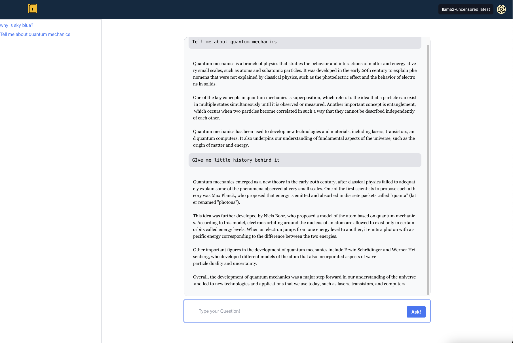

# llm-warehouse
This is basically a React app for Ollama which serves as a ChatGPT-like front end. With that being said,
all create-react-app commands are valid.

## Features
- ChatGPT like interface
- Saves previous conversation and context (when session is active)

## Prerequisites
- Nodejs and hence npm should be installed (https://nodejs.org/en)
- Ollama should be installed and running (https://ollama.ai/download)
- Some models should be present to run

## How to Run
Run `npm install` command inside the folder. Run `npm run dev` and it should start at http://localhost:3000.

## Screenshots
